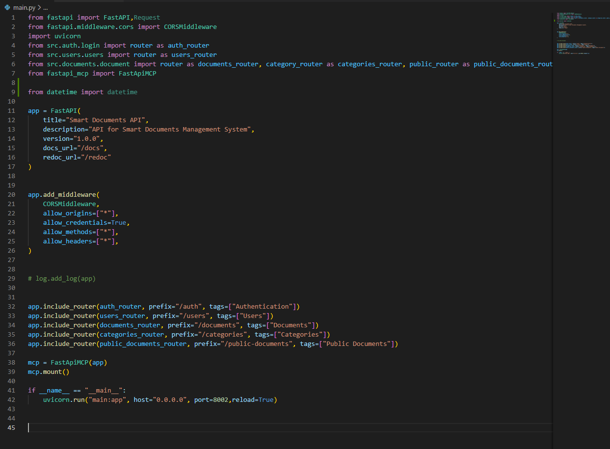

# Dark Modern (FILM69)

A modern dark theme for Visual Studio Code with consistent coloring across Python and JavaScript, enhanced readability, and carefully selected colors for optimal coding experience.


## 🖼️ Preview



## 🎨 Features

- **Consistent Language Support**: Same color scheme for Python and JavaScript for seamless multi-language development
- **Enhanced Readability**: Carefully selected colors with improved contrast for reduced eye strain
- **Modern Aesthetic**: Clean, professional dark theme based on Visual Studio's dark theme
- **Python-Optimized**: Special attention to Python syntax highlighting with distinct colors for:
  - Functions and methods
  - Variables and parameters
  - Import statements and modules
  - Punctuation and operators
  - Type hints and annotations

## 🚀 Installation

### From VS Code Marketplace

1. Open VS Code
2. Press `Ctrl+Shift+X` (or `Cmd+Shift+X` on Mac) to open Extensions
3. Search for "Dark Modern (FILM69)"
4. Click **Install**

### From VSIX File

1. Download the latest `.vsix` file from the [Releases](https://github.com/FILM6912/dark_modern_vsc/releases) page
2. Open VS Code
3. Press `Ctrl+Shift+P` (or `Cmd+Shift+P` on Mac)
4. Type "Extensions: Install from VSIX"
5. Select the downloaded file

## 🛠️ Activation

1. Press `Ctrl+Shift+P` (or `Cmd+Shift+P` on Mac)
2. Type "Preferences: Color Theme"
3. Select "Dark Modern (FILM69)"

Alternatively, you can set it in your `settings.json`:

```json
{
  "workbench.colorTheme": "Dark Modern (FILM69)"
}
```

## 🎯 Color Scheme

### Syntax Highlighting

| Element | Color | Description |
|---------|-------|-------------|
| Functions | `#DCDCAA` | Function declarations and calls |
| Types | `#4EC9B0` | Classes, types, namespaces |
| Control Flow | `#C586C0` | Keywords like `if`, `for`, `while` |
| Variables | `#9CDCFE` | Variable names and parameters |
| Constants | `#4FC1FF` | Constants and enum members |
| Strings | `#CE9178` | String literals |
| Numbers | `#B5CEA8` | Numeric literals |
| Comments | `#6A9955` | Code comments |

### Python-Specific Enhancements

| Element | Color | Description |
|---------|-------|-------------|
| Modules/Imports | `#4EC9B0` | Import statements and module names |
| Comma Separators | `#FFD700` | Golden commas for better visibility |
| Colon Separators | `#DA70D6` | Purple colons for function definitions |
| Python Punctuation | `#9CDCFE` | Consistent with variable colors |

## 📁 File Structure

```
dark_modern_vsc/
├── themes/
│   ├── dark-modern-theme.json    # Main theme configuration
│   ├── dark_vs.json             # Base VS Code dark theme
│   └── dark_defaults.json       # Default color definitions
├── package.json                 # Extension manifest
├── README.md                    # This file
└── .vscode/                     # VS Code configuration
```

## 🔧 Development

### Building the Theme

This theme is built as a VS Code extension. To modify and test locally:

1. Clone this repository:
   ```bash
   git clone https://github.com/FILM6912/dark_modern_vsc.git
   cd dark_modern_vsc
   ```

2. Install dependencies:
   ```bash
   npm install
   ```

3. Make your changes to the theme files in the `themes/` directory

4. Package the extension:
   ```bash
   vsce package
   ```

5. Install the generated `.vsix` file for testing

### Customization

The theme extends VS Code's default dark theme and can be customized by modifying:

- `themes/dark-modern-theme.json` - Main syntax highlighting rules
- `themes/dark_vs.json` - Base theme colors
- `themes/dark_defaults.json` - Default color definitions

## 🐛 Issues & Feedback

If you encounter any issues or have suggestions for improvements:

1. Check existing [Issues](https://github.com/FILM6912/dark_modern_vsc/issues)
2. Create a new issue with detailed description
3. Include screenshots for visual issues
4. Specify your VS Code version and operating system

## 📝 Changelog

### Version 1.0.0
- Initial release
- Consistent Python and JavaScript coloring
- Enhanced readability improvements
- Special Python syntax highlighting
- Modern dark aesthetic

## 🙏 Acknowledgments

- Based on Visual Studio Code's default dark theme
- Inspired by modern dark theme design principles
- Built with VS Code's theme development tools

## 📊 Compatibility

- **VS Code Version**: 1.53.0 and above
- **Operating Systems**: Windows, macOS, Linux
- **Languages**: Optimized for Python and JavaScript, with support for all VS Code supported languages

---

**Publisher**: FILM69  
**Repository**: [github.com/FILM6912/dark_modern_vsc](https://github.com/FILM6912/dark_modern_vsc)  
**Theme Name**: Dark Modern (FILM69)
